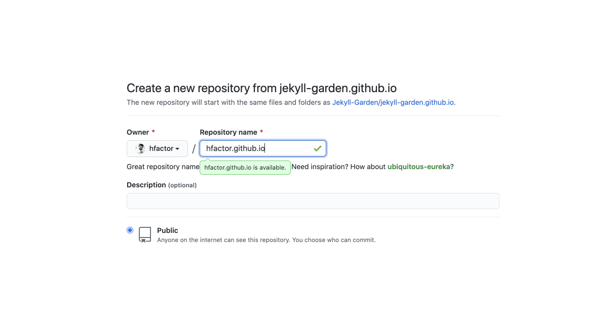

### Hi there! 👋

<br />
<br />

### Tech Stack
    


       

  

<br />

**Step 2**: Name the forked repo as `yourusername.github.io`. My Github username is hfactor, hence it's hfactor.github.io




**Step 3**: Feeling like a potatohead 🥔 every time in front of my computer.


Step 4 (Optional): If you have a custom domain, set [CNAME](https://docs.github.com/en/pages/getting-started-with-github-pages/securing-your-github-pages-site-with-https). 

Claps! The Jekyll website with a Note Garden theme is ready. Visit  `yourusername.github.io` to see that. 
_If it's not working, edit this readme (add something and commit) to trigger static page generation._

### Github to your Desktop

Step 1: Go to `yourusername.github.io`, and clone your repository to your machine. For this, you can use git-commands or install [Github for desktop.](https://desktop.github.com/) 


Step 2: Once you have successfully cloned the repository to your machine, Open the Obsidian app, and set the folder `_notes` inside the repository as your vault. 


## Obsidian

~Choosing the `_notes` folder as your vault is critical, Once done, you can start adding notes to this vault and add frontmatter to support. 
Read about theme's frontmatter at [[Welcome to the garden]]


## Frontmatter

For all notes to work properly, we need to have three frontmatter values. (If you check this MD file, you will see them as the first five lines). 

```
title:"Filename" 
notetype: feed | unfeed 
date: DD-MM-YYYY
```
The title should be the same as that for the file name (for backlinks to work). `notetype` is used to declutter the feed by hiding less relevant, supporting-notes from the feed. The date is used to sort notes in the latest one first order. (I consider it as the last updated date than created date.). 

## Updating Digital Garden

If you want to know my workflow or Obsidian folder structure, check [here]()

## Notes

The best part of Jekyll and Obsidian is that they use a standard markup language like [markdown](https://daringfireball.net/projects/markdown/) to build notes. And hence, the content becomes independent of the tool. You can use any text editor like VSCode or atom or 1Writer for iPad to edit the text. Check for plugins that do autocomplete for [[ and that's all you need! Similarly, you can use the theme without syncing locally. You can directly add and edit notes using Github or tools like [Forestry](https://forestry.io/) and modify the content! 

The best part of Obsidian is how it connects notes by auto-completing the wiki links and providing a graph view. I usually use 1Writer on iPad to make content, and Obsidian for cleanup, reading, and finding new connections. (Read my workflow)
